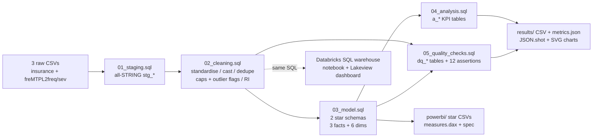

# da-learn-18 - Insurance claims analysis (medical cost drivers + motor claim frequency)

**Data Analyst learning series, project 18.** An end-to-end analyst workflow on two real, public insurance datasets:
the **Medical Cost Personal Dataset** (1,338 insured people - age, BMI, smoker, region, annual charges) and the
**French Motor Third-Party Liability portfolio freMTPL2** (678,013 policies + 26,639 claim amounts) - SQL data cleaning,
star-schema models, actuarial KPIs (claim frequency, severity, pure premium), data-quality evidence, and dashboard
packages for **Databricks** and **Power BI**.

* SQL is written in the **Databricks / Spark SQL dialect** and executed locally on **DuckDB** (a 4-macro shim file covers the differences).
* All results come from the **full datasets**. Git holds a reproducible subset of the raw data (see [Dataset](#dataset)).
* **Databricks:** schema `workspace.da_learn_18`, published Lakeview dashboard **"da-learn-18 Insurance claims analysis"**. Power BI: **kit** (a `.pbix` cannot be built on Linux).


## Business questions
1. What drives medical insurance charges - how much more do smokers cost, and how do age, BMI, children and region add to it?
2. Is BMI a cost driver on its own, or only in combination with smoking?
3. What is the motor claim frequency per policy-year, and how does it vary by driver age, bonus-malus, vehicle age and urban density?
4. How concentrated are claim costs - what share of the money comes from the largest claims?
5. How clean are the source files (duplicates, exposure > 1 year, orphan claims, claims without amounts)?

## Pipeline


## Key insights (full data)
| # | Insight |
|---|---|
| 1 | **Smokers cost 3.80x more:** $32,050 vs $8,441 average annual charges. 20.5 % of people (274 smokers) generate **49.5 %** of all charges; smoker flag correlates 0.787 with charges vs 0.298 for age and 0.198 for BMI. |
| 2 | **BMI x smoking interaction:** obese smokers average **$41,558**, about double normal-BMI smokers ($19,942); for non-smokers BMI barely matters ($7,686 -> $8,856; corr 0.08). Age drives non-smokers' cost: $3,851 at 18-24 -> $14,065 at 55-64. |
| 3 | **Motor claim frequency 0.1006 per policy-year** (36,056 claims / 358,360 policy-years). Drivers aged 18-20 claim at **0.249** vs 0.090 at 31-40; bonus-malus 101+ at **0.376** vs 0.080 at the 50 floor (4.7x); dense area F **0.139** vs rural A 0.082. |
| 4 | **Losses are tail-heavy:** 95.0 % of policies never claim; claims of EUR 100k+ are 0.16 % of claims but **24.6 %** of the EUR 59.9 M paid. Avg severity EUR 2,266 vs median EUR 1,172. |

Full write-up with data-quality findings: [`results/RESULTS.md`](results/RESULTS.md).

## Dataset
| | |
|---|---|
| Medical | Medical Cost Personal Dataset - Kaggle `mirichoi0218/insurance`; 1,338 rows x 7 columns |
| Motor | freMTPL2freq (678,013 policies x 12) + freMTPL2sev (26,639 claims x 2) - CASdatasets, Kaggle `floser/french-motor-claims-datasets-fremtpl2freq`, OpenML 41214/41215 |
| Licences | Medical: ODbL as listed on Kaggle; motor: CC0 (OpenML) |
| Full size used | ~33 MB of CSV (54 KB + 32.6 MB + 0.4 MB) |
| In git | **Subset** in `data/raw/` (134 people, 340 policies, 10 claims) built by `scripts/make_sample.py`. Details: [`data/README.md`](data/README.md) |
| Choice note | The brief allowed "medical insurance cost / car insurance claims". The medical file has no claim counts, so it is paired with the standard motor-claims benchmark to cover claim frequency. |

## Cleaning steps (sql/02_cleaning.sql) - full-data row counts
| Step | Raw -> clean |
|---|---|
| Medical: trim + lowercase sex/smoker/region, `TRY_CAST`, exact-duplicate removal with `ROW_NUMBER()` | 1,338 -> **1,337** (1 duplicate) |
| Medical: bands (age, WHO BMI class, children) + outlier flags (Q3 + 1.5 IQR, top 1 %) | 139 / 14 flagged, kept |
| Motor policies: strip ARFF quotes, standardise fuel, `TRY_CAST`, dedupe on IDpol | 678,013 -> 678,013 (0 duplicates) |
| Motor policies: actuarial caps - Exposure <= 1 year, ClaimNb <= 4 | 1,224 exposures capped, 9 claim counts capped |
| Motor policies: driver age / vehicle age / bonus-malus bands; VehAge > 30 and DrivAge > 90 flags | 1,116 / 401 flagged, kept |
| Motor claims: drop orphan claims (IDpol not in policy file), flag top-1 % large losses | 26,639 -> **26,444** (195 orphans); 265 large losses |
| Star schema (03) | fact_medical_member 1,337; fact_motor_policy 678,013; fact_motor_claim 26,444; 6 dims |
| Assertions (05) | **12 / 12 PASS** |

## How to run
```bash
pip install -r requirements.txt
python run_pipeline.py --source sample        # subset in git -> data/clean, powerbi/data, results/sample/JSON.shot
python scripts/download_full_data.py          # full data into data/raw_full (SHA-256 verified, Parquet -> CSV)
python run_pipeline.py --source full          # -> data/clean_full, results/ (tables, metrics.json, JSON.shot, charts)
python scripts/build_databricks.py --with-dashboard   # regenerate notebook + dashboard JSON from sql/
```
* **Databricks**: see [`databricks/SETUP.md`](databricks/SETUP.md).
* **Power BI**: see [`powerbi/BUILD_GUIDE.md`](powerbi/BUILD_GUIDE.md).

## Databricks run (2026-10-02)
| Object | Workspace path |
|---|---|
| Raw CSVs (full) | `/Volumes/workspace/da_learn_18/raw/` |
| Tables | `workspace.da_learn_18` (stg_*, cln_*, dim_*, fact_*, a_*, dq_*) |
| Notebook | `/Workspace/Shared/da-learn-18-insurance-claims-analysis/insurance_pipeline_notebook` |
| Dashboard (published) | "da-learn-18 Insurance claims analysis" - 2 pages, 8 visuals (2 counters + 6 charts) |

Executed 21:25-21:35 IST: all 15 core table row counts match DuckDB; KPIs match except values built on `percentile_approx`
(large-loss share 38.04 % vs 38.01 %). Details: `databricks/run_outputs/duckdb_vs_databricks.json`.

## Repo layout
```
run_pipeline.py              # runs sql/00..05 on DuckDB, exports CSV/JSON, renders charts
project_config.py            # tables to export + snapshot contents
requirements.txt
sql/
  00_duckdb_compat.sql       # DuckDB-only shims for Spark functions (skip on Databricks)
  01_staging.sql             # raw CSVs -> all-STRING stg_medical / stg_motor_policy / stg_motor_claim
  02_cleaning.sql            # cln_medical, cln_motor_policy, cln_motor_claim
  03_model.sql               # 2 stars: fact_medical_member + fact_motor_policy / fact_motor_claim + 6 dims
  04_analysis.sql            # a_* KPI tables (15)
  05_quality_checks.sql      # dq_row_counts, dq_null_rates, dq_issues, dq_assertions
scripts/
  download_full_data.py      # full data from mirrors + SHA-256 check
  make_sample.py             # deterministic subset -> data/raw
  make_charts.py, svgmin.py  # SVG dashboard + charts
  build_databricks.py, dbx_config.py  # notebook + Lakeview dashboard generator
data/
  raw/                       # subset of the 3 raw CSVs
  clean/cleaned/             # cleaned medical + motor claims (subset run)
  README.md
databricks/                  # notebook + dashboard (exported from the workspace), run_outputs/, SETUP.md
powerbi/                     # data/ (star CSVs, sample), measures.dax, model.md, dashboard_spec.md, BUILD_GUIDE.md
results/
  RESULTS.md  metrics.json  JSON.shot
  charts/*.svg               # dashboard.svg + 8 panels
  tables/*.csv
  sample/JSON.shot
```

## SQL dialect notes
Scripts 02-05 are Spark SQL. DuckDB runs them after `00_duckdb_compat.sql` defines `unix_timestamp`, 2-arg `datediff(end, start)`,
`percentile_approx` and Spark-style `dayofweek`. Staging differs (`read_csv` vs `read_files`). `percentile_approx` is exact on DuckDB and approximate on Databricks.

## Limitations
* The medical and motor datasets are independent portfolios (US vs France); they are compared side by side, never joined.
* 9,116 motor policies report claims without a severity record, so severity and pure premium use only 26,444 priced claims (pure premium is understated).
* freMTPL2 (OpenML 2018 release, French insurer, ~2011-2013) is the original version; the CASdatasets R package now ships a corrected 677,991-policy version.
* The medical file is a small teaching dataset; insights are methodological, not pricing advice.

Data licences: medical - ODbL (Kaggle listing); motor - CC0 (OpenML, CASdatasets origin). Code: MIT.

## Complete dataset
| | |
|---|---|
| Kaggle pages | https://www.kaggle.com/datasets/mirichoi0218/insurance and https://www.kaggle.com/datasets/floser/french-motor-claims-datasets-fremtpl2freq |
| Mirror URLs | https://raw.githubusercontent.com/stedy/Machine-Learning-with-R-datasets/master/insurance.csv<br/>https://data.openml.org/datasets/0004/41214/dataset_41214.pq (freMTPL2freq, OpenML 41214)<br/>https://data.openml.org/datasets/0004/41215/dataset_41215.pq (freMTPL2sev, OpenML 41215) |
| Licence | Medical: Open Database License (ODbL) per the Kaggle listing; freMTPL2freq/sev: **CC0** on OpenML (originally R package CASdatasets, Dutang & Charpentier) |
| Total size | ~33 MB as CSV (insurance.csv 54 KB; freMTPL2freq.csv 32.6 MB; freMTPL2sev.csv 397 KB); Parquet downloads 7.5 MB + 0.3 MB |
| File list | `insurance.csv` (age, sex, bmi, children, smoker, region, charges - 1,338 rows); `freMTPL2freq.csv` (IDpol, ClaimNb, Exposure, Area, VehPower, VehAge, DrivAge, BonusMalus, VehBrand, VehGas, Density, Region - 678,013 rows); `freMTPL2sev.csv` (IDpol, ClaimAmount - 26,639 rows) |
| Download | `python scripts/download_full_data.py` -> writes `data/raw_full/` (SHA-256 verified; Parquet converted to CSV) |
