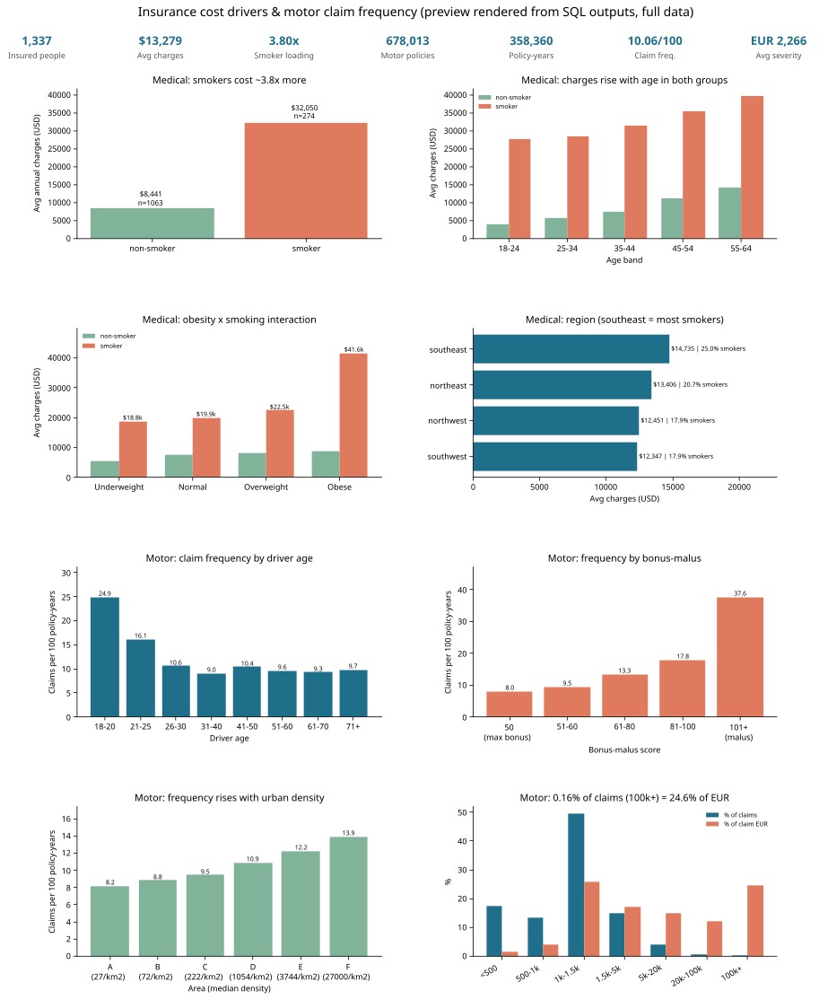

# Results - full data (1,337 insured people + 678,013 motor policies / 26,444 claims)

Run: `python run_pipeline.py --source full` on DuckDB 1.5.6 (Python 3.13), 2026-10-02. Every number below is copied from
`results/tables/*.csv` / `metrics.json` produced by that run. Medical charges are USD per year; motor claim amounts are EUR.

## Headline KPIs
| KPI | Value |
|---|---|
| Insured people (medical, after dedupe) | 1,337 |
| Avg / median annual charges | $13,279.12 / $9,386.16 |
| Smokers | 20.49 % |
| Avg charges smoker / non-smoker | **$32,050.23 / $8,440.66 (3.80x)** |
| Obese (BMI >= 30) | 52.80 % |
| Motor policies | 678,013 |
| Exposure | 358,360.11 policy-years |
| Claims (ClaimNb capped at 4) | 36,056 |
| **Claim frequency** | **0.10061 claims per policy-year** (10.06 per 100) |
| Claims with an amount | 26,444 |
| Avg / median severity | EUR 2,265.51 / EUR 1,172.00 |
| Pure premium (loss cost) | EUR 167.18 per policy-year (understated - see caveats) |
| Share of claim EUR from top-1 % claims | 38.01 % |

## Key findings
1. **Smoking is the dominant medical cost driver.** Smokers average **$32,050** vs **$8,441** (3.80x); 274 smokers (20.5 %) generate
   **49.46 %** of all charges. Correlation with charges: smoker flag **0.787**, age 0.298, BMI 0.198, children 0.067.
2. **BMI only matters for smokers.** Obese smokers average **$41,558** vs **$22,496** for overweight and $19,942 for normal-BMI smokers,
   while non-smokers barely move with BMI ($7,686 normal vs $8,856 obese). Correlation BMI-charges is **0.807 for smokers** but **0.084 for non-smokers**.
   Age is the main driver for non-smokers (corr 0.627): $3,851 at 18-24 vs $14,065 at 55-64.
3. **Region is a weak, smoker-mix effect.** Southeast is most expensive ($14,735 avg) but also has the most smokers (25.0 %) and highest
   avg BMI (33.36); its non-smoker average ($8,032) is actually the lowest of the four regions.
4. **Motor claim frequency** is **0.249** per policy-year for 18-20-year-old drivers vs **0.090** at 31-40 (2.8x), and new drivers' claims are
   costly (avg severity EUR 13,431, pure premium EUR 3,206). Bonus-malus is the strongest rating factor: **0.080** at the 50 floor vs **0.376** at 101+ (4.7x).
   Frequency rises steadily with urban density: area A **0.082** -> F **0.139**.
5. **Losses are tail-heavy.** 94.98 % of policies have no claim. Claims of EUR 100k+ are **0.16 %** of claims (41) but **24.55 %** of the money;
   the EUR 1k-1.5k band holds 49.4 % of claims (a fixed-fee cluster) but only 25.8 % of EUR.

## Data quality (what the cleaning found / did)
| Entity | Raw rows | Clean rows | Treatment |
|---|---|---|---|
| medical | 1,338 | 1,337 | 1 exact duplicate dropped; sex/smoker/region standardised; age/BMI(WHO)/children bands; 139 IQR outliers + 14 top-1 % flagged (kept) |
| motor_policy | 678,013 | 678,013 | 0 duplicate IDpol; 1,224 exposures > 1 year capped at 1; 9 ClaimNb > 4 capped at 4; 1,116 VehAge > 30 and 401 DrivAge > 90 flagged |
| motor_claim | 26,639 | 26,444 | 195 orphan claims (IDpol not in policy file) dropped; 265 large losses (top 1 %) flagged |
| fact / dims | - | 1,337 / 678,013 / 26,444 | dims: 4 US regions, 4 BMI classes, 6 areas, 22 French regions, 235 vehicles, 8 driver-age bands |

Integrity: **9,116 policies have ClaimNb > 0 but no severity record** (a known gap in freMTPL2sev), 1 policy has a severity count that differs
from ClaimNb. Null rates are 0 % in all required columns. **All 12 assertions in `dq_assertions` PASS.**

Cross-engine check: the same SQL ran on Databricks; all 15 core tables have identical row counts. Only `percentile_approx` values differ
(large-loss share 38.04 % on Databricks vs 38.01 % DuckDB). See `../databricks/run_outputs/duckdb_vs_databricks.json`.

## Caveats
* The two datasets are **independent** (US medical cohort, French motor portfolio); they are analysed side by side, never joined.
* Pure premium and severity use only the 26,444 claims that have an amount; frequency uses all 36,056 claims, so pure premium is understated.
* `insurance.csv` is a small, simulated-looking teaching dataset (from *Machine Learning with R*); treat it as illustrative.
* No calendar dates in either source, so there is no time trend.

## Charts (SVG, vector only)
`charts/dashboard.svg` (8-panel preview) and the individual panels: `med_smoker_charges.svg`, `med_age_smoker.svg`, `med_bmi_smoker.svg`,
`med_region.svg`, `motor_freq_driver_age.svg`, `motor_freq_bonus_malus.svg`, `motor_freq_area.svg`, `motor_severity_concentration.svg`.

## Files
* `metrics.json` - all KPIs, key breakdowns, data-quality stats, engine/timings
* `JSON.shot` - headline KPI snapshot + run config
* `tables/` - every `a_*` (analysis) and `dq_*` (quality) table as CSV
* `sample/JSON.shot` - the same pipeline on the repo subset (`--source sample`), for verification only
